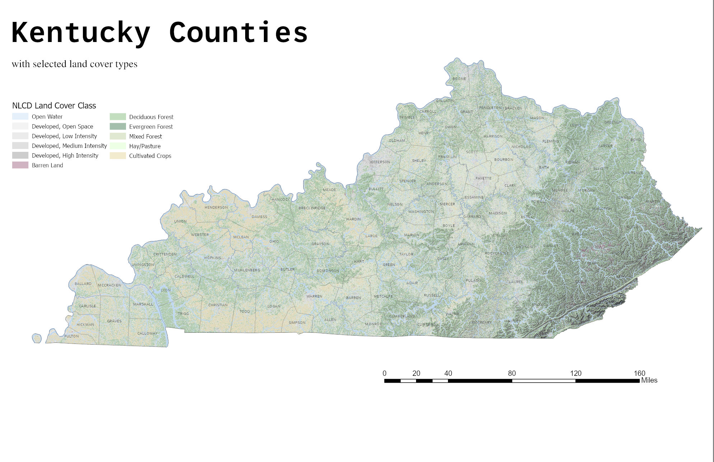

# GEO409 Field Trip Maps
Maps for field trip to measure tree canopy
All created and designed by Brian Metz

Visit: https://brianemetz.github.io/geo-409-field-trip/

   
Kentucky counties with selected land cover types – [Download geospatial PDF](KyLandcover.pdf)

   
UKy central campus canopy model – [Download geospatial PDF](TreeHeight.pdf)

Maps created by Brian Metz for GEO409, Spring 2023, University of Kentucky Department of Geography
